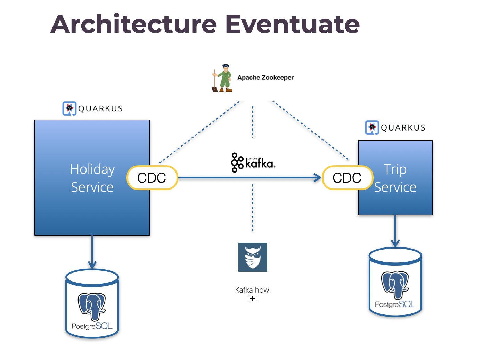
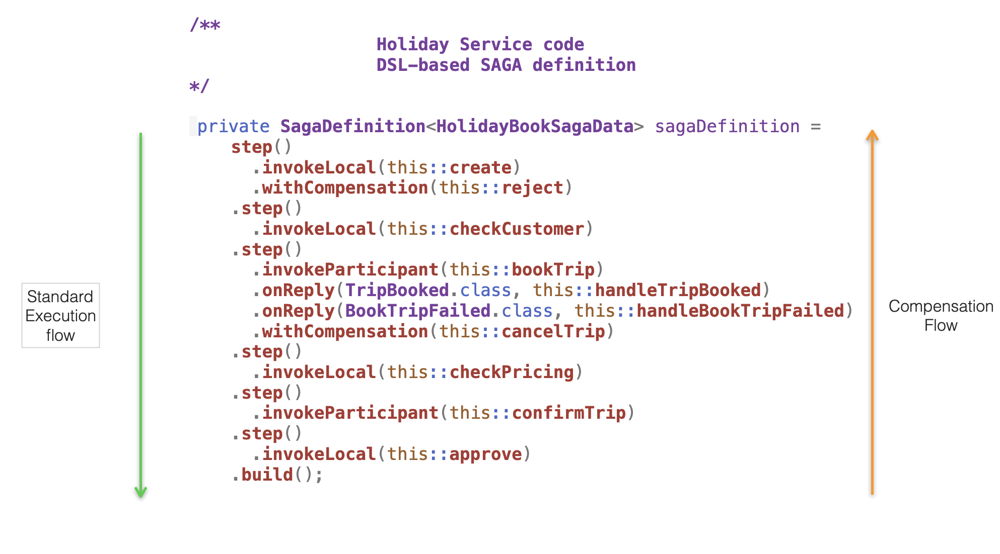
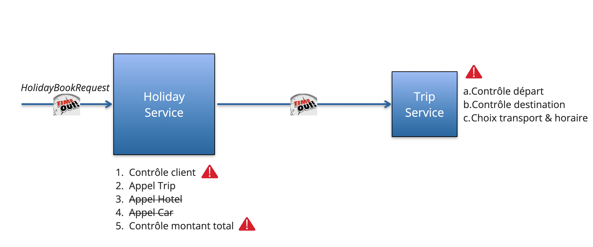
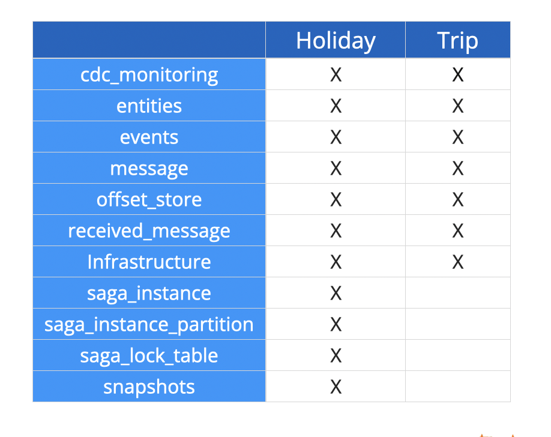
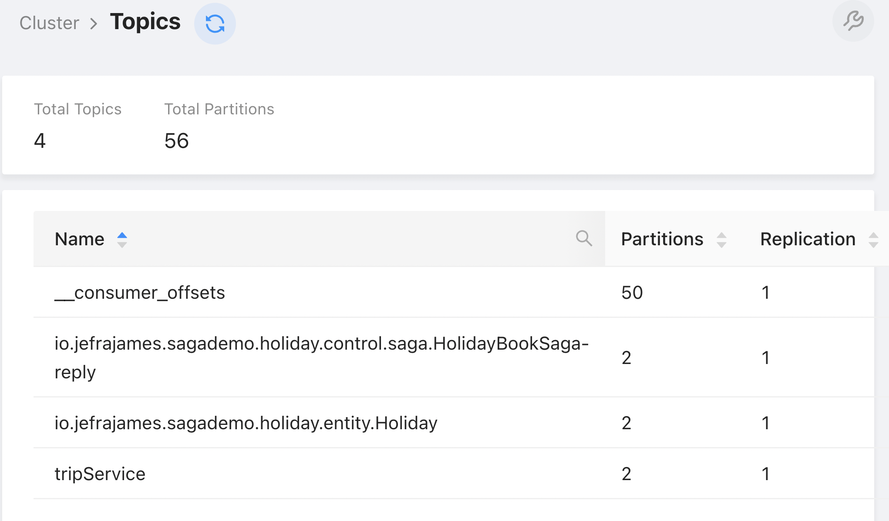

= Eventuate SAGA demo

This project demonstrates how to use Eventuate Tram Saga on a concrete use case.

It has been showcased during talks such as Devoxx France, Bordeaux JUG and DevFest Lille.

It is made of 3 modules :

. **Holiday service**: the edge service exposed to the outside. Orchestrates the SAGA and invokes specialized backend services such as trip, hotel and car. In this version, only trip is implemented. Feel free to download the code and to complete it with the 2 other services. This will be a good exercice!
. **Trip service**: a backend service invoked by Holiday
. **Trip API messaging**: defines the messages (commands and replies) handled by Trip.

== Technical architecture

Comments:

. Both services are implemented with **Quarkus**
. They expose a REST API and uses CDI and JPA internally
. They communicate with asynchronous messaging
. Both services have their own *PostgreSQL* database
. *CDC* stands for Change Data Capture. It is an Eventuate component that implements the  https://microservices.io/patterns/data/transactional-outbox.html[Transactional outbox pattern]. Eventuate messages (commands, replies, events) are written in a message table before being published on a Kafka topic. The CDC acts as message relay and ensures transaction messages and duplication detection 
. *Kafka* is used as message broker
. *Howl* is a  https://github.com/redpanda-data/kowl[Kafka GUI] enabling to easily browse topics, messages, consumer groups
. *Zookeeper* supervises Kafka and CDC. 

It is possible to run several CDC similar instances running in parallel (sharing the same EVENTUATELOCAL_CDC_LEADERSHIP_LOCK_PATH), but only one is elected active by Zookeeper and able to read the message table.

=== About the SAGA definition

SAGA offer a lightweight distributed transaction model on top of local ACID transactions.

The corner stone of the programming model is the SAGA definition. It is based on a specific DSL (Domain Specifica Language) enabling to define steps. Each step is made of actions (local or remote) and optional compensation operations:

The execution of the SAGA is asynchronous. It is suspended when waiting for IO and persisted in database. When resuming, it can be run by any worker thread.

This model based on a DSL is called **Orchestration**. Eventuate offers an alternative model based on domain events called **Choreography**. Orchestration is recommended for complex use cases.

== Bridging synchronous and asynchronous execution

_HolidayBookRequest_ is received in a synchronous way on a REST endpoint (see __HolidayResource__). In contrast, the execution of the SAGA is asynchronous. 

For the demo, in order to display the complete response in Swagger-UI, it has been necessary to bridge the 2 modes of execution:

. The answer to HolidayBookRequest is asynchronous using a _CompetionStage<Response>_ response code. It is completed afterwards when the execution of the SAGA is finished 
. The end of a SAGA is notified by a _HolidayBookSagaFinishedEvent_ domain event. This event is published by _HolidayBookSaga_ (see _onSagaCompletedSuccessfully_ and 
  _onSagaRolledBack_ methods) 
. This domain event is consumed by _HolidayEventConsumer_ to complete the pending JAX-RS Response
. _SagaToCompletableFuture_ stores the association of SAGAs instance and associated _CompletableFuture_ JAX-RS Responses.

== Technical context

As of this date (June 2022), the following technical context has been used:

. Java 17
. Quarkus 2.8.0.Final
. Maven 3.8.4
. docker compose
. Eventuate Tram 0.3.0.RELEASE

It has been developped on MacOS. Some fixes may be required on Linux or Windows. Docker images support arm64 (Mac M1) architecture. 

== Ports in use

. Zookeeper: 2181
. Kafka: 9092,29092
. Kafka Howl: 9088
. Postgres-Holiday: 5436
. Postgres-Trip: 5434
. cdc-holiday: 9086
. cdc-trip: 9084
. Quarkus-Trip: 9082
. Quarkus-Holiday: 9080

== How to build

Run _mvn clean package_ in the main directory.

== How to start the demo

=== Start the infrastrucure

Zookeeper, Kafka, Kafka Howl, PostgreSQLs and CDCs are run with docker compose.

To start them:

. cd saga-infra
. ./start-infra.sh: previous containers and volumes are pruned to start with a fresh situation.

After the infrastructure has been started, you can check both CDCs to ensure that they are connected to the database and Kafka:

. cdc-holiday: http://localhost:9086/actuator/health
. cdc-trip: http://localhost:9084/actuator/health

Warning: both CDCs are configured to read the message table in polling mode which is not optimal in production. Tailing the transaction log is highly recommended to improve performance and scalability.

=== Start Trip

. cd trip
. ./start-trip.sh

=== Start Holiday

. cd holiday
. ./start-holiday.sh

== Understanding the demo

Before running the demo, it is important to understand the processing in place:

Comments:

. *Holiday* acts as the edge service exposed to the outside. When receiving a HolidayBookResource, it starts a SAGA that orchestrates the processing
. It invokes *Trip* which checks the departure (accepted value: Paris) and the destination (accepted values: London, Dublin, Budapest, Barcelona), determines the transport (BOAT, TRAIN, PLANE) and the time schedule
. Invoking Hotel and Car is not yet implemented
. Holiday checks the total price that shouldn't exceed 500.00

 
The request is rejected if:

* customer id is NOK
* departure and destination are NOK
* total price exceeds the maximum value.

It is accepted if all checks are OK.

= Eventuate database

Eventuate needs some database tables to work:

PS6PY can be used to understand how they are accessed behind the scene. You can activate it on Holiday by setting application.properties:
[source,properties]
----
quarkus.datasource.jdbc.driver=com.p6spy.engine.spy.P6SpyDriver
----

Warning: P6SPY does not work with Quarkus prod mode.

== How to run the demo

All the demo can be run from Holiday Swagger UI: http://localhost:9080/q/swagger-ui/

Kafka traffic can be checked from Kafka Howl: http://localhost:9088/topics

Trip Swagger UI can also be used to check the status of Trip entities: http://localhost:9082/q/swagger-ui/

=== Kafka topics

When the application is launched, several Kafka topics are created:

Comments:

* tripService is used by Trip to receive commands
* *-reply is used by Trip to send command responses
* Holiday is used to publish Holiday domain events.

=== Demo 1: accepted request

From Holiday Swagger UI: 

. Chose HolidayResource POST "Book a Holiday with LRA"
. Select "Let's go to London" from the examples
. Try and execute it.

The response status should be ACCEPTED.

You can check the Kafka messages that have been exchanged between Holiday and Trip with Kafka Howl by digging in the  Topics. 
In particular, you can check that Trip reply (HolidayBookSaga topic) header reply_outcome-type is set to SUCCESS.

Check the consistency of the Trip entity:

. Get the trip_id value of the response in Holiday Swagger UI
. Go to Trip Swagger UI and select "find by id"
. The status should be ACCEPTED.

=== Demo 2: customer id NOK

From holiday Swagger UI:

. Change the customer id value to 4
. Execute it.

The request has been rejected by Holiday with a business error "Unknown customer".

=== Demo 3: destination NOK

From holiday Swagger UI:

. Reset the customer id value to 42
. Change the destination to "Londonx"
. Execute it.

The request has been rejected by Trip with a business error "Rejected destination Londonx".

Check the consistency of the Trip entity:

. Get the trip_id value of the response in Holiday Swagger UI
. Go to Trip Swagger UI and select "find by id"
. The status should be REJECTED

With Kafka Howl, you can check that Trip reply (HolidayBookSaga topic) header reply_outcome-type is set to FAILURE. This triggers a SAGA compensation. 

=== Demo 4: max price exceeded

From holiday Swagger UI:

. Reset the destination value to "London"
. Change the value of people_count to 2
. Execute it

The request has been rejected by Holiday with a business error "Max pricing exceeded".

Check the consistency of the Trip entity:

. Get the trip_id value of the response in Holiday Swagger UI
. Switch to Trip Swagger UI and select "find by id"
. The status should be CANCELED.

== Quarkus native mode

Building Holiday in native mode does not work yet. There is an error due to the use of java.util.Random. This is under investigation.

== Performance consideration

The internal response time is measured for each request (see _book_response_time_ field). It includes the complete SAGA execution. It can be improved in production by running the CDC in Transaction Log Tailing (vs SQL polling).

